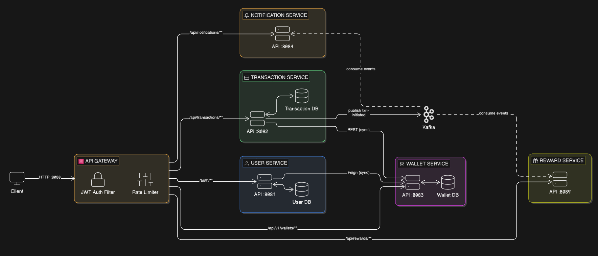

# PayPal Clone – Overview & Guide

This project is a **PayPal-style payment system** built with **Spring Boot microservices**, an **API Gateway**, and **Kafka** for events.

The goal of this README is to explain the **big picture in simple language** so you can:
- Remember how everything fits together
- Quickly see which service talks to which
- Know how to run it again in the future
- Understand the main edge cases and how they are handled

---
-## Quickstart (TL;DR)

- Start Kafka:
  - From the project root (where `docker-compose.yml` is):
    ```bash
    docker-compose up
    ```
- Start services (each in its own terminal):
  - `mvn spring-boot:run` inside `api-gateway`, `user-service`, `wallet-service`, `transaction-service`, `notification-service`, `reward-service`.
- Basic flow to test:
  1. `POST /auth/signup` to create a user (gateway: `http://localhost:8080`).
  2. `POST /auth/login` to get a JWT token.
  3. `POST /api/transactions/create` (with JWT) to transfer money.
  4. `GET /api/notifications/{userId}` and `GET /api/rewards/user/{userId}` to see side effects.

Key Highlights:
- Microservices architecture (6 services)
- JWT-based authentication via API Gateway
- Distributed transaction handling with compensation
- Kafka-based async notifications & rewards
- Pessimistic locking for wallet concurrency safety
- 2-phase hold/capture wallet mechanism

## 1. High-Level Architecture

### 1.1 Services and Ports

- **API Gateway** (Spring Cloud Gateway) – `http://localhost:8080`
- **User Service** – `http://localhost:8081`
- **Transaction Service** – `http://localhost:8082`
- **Wallet Service** – `http://localhost:8083`
- **Notification Service** – `http://localhost:8084`
- **Reward Service** – `http://localhost:8089`
- **Kafka** (Docker) – `localhost:9092`
- **Zookeeper** (Docker) – `localhost:2181`

All services (except the gateway) are regular Spring Boot apps with their own H2 in‑memory database.

### 1.2 Tech Stack

- **Java 17**, **Maven**, **Spring Boot 3.5.x**
- **Spring Cloud Gateway** (reactive) for routing + JWT auth + rate limiting
- **Spring Security + JWT** for authentication
- **Spring Data JPA + H2** for persistence (in‑memory)
- **Apache Kafka** for async events (`txn-initiated` topic)
- **OpenFeign** (user-service → wallet-service)
- **RestTemplate** (transaction-service → wallet-service)

### 1.3 Who Talks to Whom

- All client calls go to **API Gateway** on port `8080`.
- Gateway forwards to microservices:
  - `/auth/**` → **user-service** (8081)
  - `/api/transactions/**` → **transaction-service** (8082)
  - `/api/v1/wallets/**` → **wallet-service** (8083)
  - `/api/notifications/**` → **notification-service** (8084)
  - `/api/rewards/**` → **reward-service** (8089)
- **User-service → Wallet-service** (HTTP, via Feign) for auto wallet creation on signup.
- **Transaction-service → Wallet-service** (HTTP, via RestTemplate) for debit/credit on transfer.
- **Transaction-service → Notification & Reward services** (Kafka topic `txn-initiated`).

---

## 1.4 ER Diagram (Database View)

The following diagram shows the main entities (users, wallets, transactions, notifications, rewards) and how they relate.



---

## 2. How to Run the System

### 2.1 Start Kafka via Docker

From the project root:

```bash
docker-compose up
```

This starts:
- Zookeeper at `localhost:2181`
- Kafka at `localhost:9092`

### 2.2 Start Each Service

In separate terminals (or from your IDE), from the folder of each service:

```bash
cd api-gateway
mvn spring-boot:run

cd user-service
mvn spring-boot:run

cd wallet-service
mvn spring-boot:run

cd transaction-service
mvn spring-boot:run

cd notification-service
mvn spring-boot:run

cd reward-service
mvn spring-boot:run
```

> Note: API Gateway rate limiting uses Redis. To fully enable rate limiting, you should have a Redis server running on the default port. Without Redis, the gateway config may need to be adjusted or the rate limiter disabled.

---

## 3. Request Flows (Step by Step)

### 3.1 Signup Flow (Creates User + Wallet)

1. **Client → Gateway**
   - `POST http://localhost:8080/auth/signup`
   - Body: name, email, password
2. **Gateway** does **not** require JWT for `/auth/signup`.
3. Request forwarded to **user-service** (`/auth/signup`).
4. **User-service**:
   - Checks if email already exists.
   - Saves `User` (password encoded, role set).
   - Calls **wallet-service** using Feign client:
     - `POST http://localhost:8083/api/v1/wallets` with `{ userId, currency="INR" }`.
   - If wallet creation fails, deletes the user again (manual rollback) and throws an error.

**Result:** A new user is created and a wallet is automatically created for that user.

### 3.2 Login Flow (Get JWT Token)

1. **Client → Gateway**
   - `POST http://localhost:8080/auth/login`
2. Gateway again does **not** enforce JWT on `/auth/login`.
3. Forwarded to **user-service** (`/auth/login`).
4. **User-service**:
   - Looks up user by email.
   - Verifies password using BCrypt.
   - Generates a **JWT** with:
     - subject = user email
     - claims = { role, userId }
   - Returns token in a simple `JwtResponse`.

**You will use this token as** `Authorization: Bearer <token>` for protected endpoints.

### 3.3 Gateway JWT Handling

The gateway has a **GlobalFilter**:

- Allows these paths without JWT:
  - `/auth/signup`
  - `/auth/login`
- For all other paths:
  - Reads `Authorization` header.
  - Validates the JWT.
  - On success, injects headers:
    - `X-User-Email`
    - `X-User-Id`
    - `X-User-Role`
  - Forwards request to the target service.
  - On failure, returns **401 Unauthorized**.

### 3.4 Money Transfer Flow (Key Business Flow)

1. **Client → Gateway**
   - `POST http://localhost:8080/api/transactions/create`
   - JWT required, body contains senderId, receiverId, amount.
2. Gateway validates JWT and forwards to **transaction-service**.
3. **Transaction-service** steps:
   - Creates a `Transaction` with status = `PENDING` and saves it.
   - **Step 1: Debit sender wallet**
     - Calls **wallet-service** `/api/v1/wallets/debit` with `{userId=senderId, currency="INR", amount}`.
     - If debit fails (no wallet, insufficient funds, etc.), sets status = `FAILED`, saves, and throws an error.
   - **Step 2: Credit receiver wallet**
     - Calls **wallet-service** `/api/v1/wallets/credit` with `{userId=receiverId, currency="INR", amount}`.
     - If credit fails, it **refunds the sender** by calling credit on the sender wallet, sets status = `FAILED`, saves, and throws an error.
   - **Step 3: Mark transaction SUCCESS**
     - Updates status to `SUCCESS`, saves.
   - **Step 4: Publish Kafka event**
     - Sends the transaction to Kafka topic `txn-initiated`.

**Result:** Money moves from sender wallet to receiver wallet, and an event is sent to Kafka.

### 3.5 Notification Flow (After a Successful Transaction)

1. **Kafka** has a message on `txn-initiated`.
2. **notification-service** listens to that topic.
3. On each message:
   - Builds a `Notification` entity.
   - For now, it uses `senderId` as the `userId` for the notification.
   - Saves the notification with a message like: `₹<amount> received from user <senderId>`.
4. You can fetch notifications via:
   - `GET http://localhost:8080/api/notifications/{userId}` (through gateway).

### 3.6 Rewards Flow (After a Successful Transaction)

1. **Kafka** sends the same `txn-initiated` event to **reward-service** (different consumer group).
2. **reward-service**:
   - Checks if a reward already exists for this `transactionId`.
     - If yes, it skips (prevents duplicate rewards).
   - Creates a `Reward` record with:
     - `userId = senderId`
     - `points = amount * 100`
     - `transactionId = transaction.id`
   - Saves it in H2.
3. You can fetch rewards via:
   - `GET http://localhost:8080/api/rewards/` (all)
   - `GET http://localhost:8080/api/rewards/user/{userId}` (by user)

### 3.7 Wallet Operations (Direct)

Available endpoints on wallet-service (through gateway):

- `POST /api/v1/wallets` → create wallet
- `POST /api/v1/wallets/credit` → credit money
- `POST /api/v1/wallets/debit` → debit money
- `GET /api/v1/wallets/{userId}` → get wallet by user id
- `POST /api/v1/wallets/hold` → place a hold (reserve funds without taking them yet)
- `POST /api/v1/wallets/capture` → capture a hold (actually subtract the held amount)
- `POST /api/v1/wallets/release/{holdReference}` → release a hold (give funds back to available balance)

The hold/capture pattern is a 2‑phase payment mechanism (similar to card pre-auth and capture). Currently, the transaction-service uses direct debit/credit, but the hold APIs are available for future flows.

---

## 4. Edge Cases & How They Are Handled

### 4.1 User Signup

- **Duplicate email**: user-service returns an error, no user created.
- **Wallet creation fails**: user is deleted to keep things consistent.

### 4.2 Login

- **User not found**: returns HTTP 401.
- **Wrong password**: returns HTTP 401.

### 4.3 JWT / Gateway

- **Missing or invalid token** for protected paths: gateway returns HTTP 401.
- **Public paths** (`/auth/signup`, `/auth/login`): allowed without JWT.

### 4.4 Transaction + Wallet

- **Insufficient funds when debiting**:
  - wallet-service throws an exception.
  - transaction-service marks the transaction as `FAILED` and returns an error.
- **Sender wallet not found**:
  - same as above, transaction fails.
- **Receiver wallet not found or credit fails**:
  - transaction-service refunds the sender by crediting back the amount.
  - transaction status is set to `FAILED`.
- **Kafka send failure**:
  - Transaction remains `SUCCESS`.
  - Only the event publishing fails (logged to stderr). Notifications and rewards may be missing for that transaction.

### 4.5 Reward Service

- **Duplicate Kafka event (replay / re-delivery)**:
  - Reward service checks `existsByTransactionId` before creating a new reward.
  - Also, the `transactionId` column is unique in the database.
  - This guarantees **no double rewards** for one transaction.

### 4.6 Notification Service

- Right now, the service:
  - Creates a notification for the **sender**, not the receiver.
  - This is easy to change later if you want receiver-based notifications.

### 4.7 Wallet Concurrency & Holds

- **Concurrent operations**:
  - `WalletRepository` uses pessimistic locking to prevent race conditions.
- **Holds**:
  - If there is not enough available balance when placing a hold, an error is thrown.
  - A scheduled task cleans up expired holds (if you extend expiry logic).

---

## 5. Where Things Live (Quick Map)

### 5.1 API Gateway (Routing + JWT)

- Routes config: `api-gateway/src/main/resources/application.yml`
- JWT filter: `api-gateway/src/main/java/com/paypal/api_gateway/filters/JwtAuthFilter.java`
- Rate limit config: `api-gateway/src/main/java/com/paypal/api_gateway/config/RateLimitConfig.java`
- JWT util: `api-gateway/src/main/java/com/paypal/api_gateway/util/JWTUtil.java`

### 5.2 User Service (Auth + Users)

- Controllers: `user-service/src/main/java/com/paypal/user_service/controller/`
  - `AuthController` (signup, login)
  - `UserController` (user info)
- Service: `UserServiceImpl` (creates user, calls wallet-service)
- JWT util & filter: `user-service/src/main/java/com/paypal/user_service/util/`
- Feign client to wallet: `user-service/src/main/java/com/paypal/user_service/client/WalletClient.java`

### 5.3 Wallet Service (Balances + Holds)

- Controller: `wallet-service/src/main/java/com/paypal/wallet_service/controller/WalletController.java`
- Service: `wallet-service/src/main/java/com/paypal/wallet_service/service/WalletServiceImpl.java`
- Entities: `Wallet`, `WalletHold`, `Transaction`
- Repositories: `WalletRepository`, `WalletHoldRepository`, `TransactionRepository`

### 5.4 Transaction Service (Transfers + Kafka Producer)

- Controller: `transaction-service/src/main/java/com/paypal/transaction_service/controller/TransactionController.java`
- Service: `transaction-service/src/main/java/com/paypal/transaction_service/service/TransactionServiceImpl.java`
- Kafka producer: `transaction-service/src/main/java/com/paypal/transaction_service/kafka/KafkaEventProducer.java`
- Config (RestTemplate): `transaction-service/src/main/java/com/paypal/transaction_service/config/AppConfig.java`

### 5.5 Notification Service (Kafka Consumer)

- Controller: `notification-service/src/main/java/com/paypal/notification_service/controller/NotificationController.java`
- Kafka consumer: `notification-service/src/main/java/com/paypal/notification_service/kafka/NotificationConsumer.java`

### 5.6 Reward Service (Kafka Consumer + Rewards)

- Controller: `reward-service/src/main/java/com/paypal/reward_service/controller/RewardController.java`
- Kafka consumer: `reward-service/src/main/java/com/paypal/reward_service/kafka/RewardConsumer.java`
- Repo: `reward-service/src/main/java/com/paypal/reward_service/repository/RewardRepository.java`

---

## 6. Future Improvements (Ideas)

- Replace H2 with PostgreSQL/MySQL for persistence.
- Use the **hold/capture** flow for transfers instead of direct debit/credit.
- Improve notifications (send to receiver, not just sender).
- Move wallet-service URL into service discovery or config, not hardcoded.
- Externalize JWT secret to config / environment variables.

You can come back to this README anytime to remember:
- How requests flow through the system
- Which service is responsible for what
- How edge cases and failures are handled
- Where to look in the code when you want to change a specific behavior
